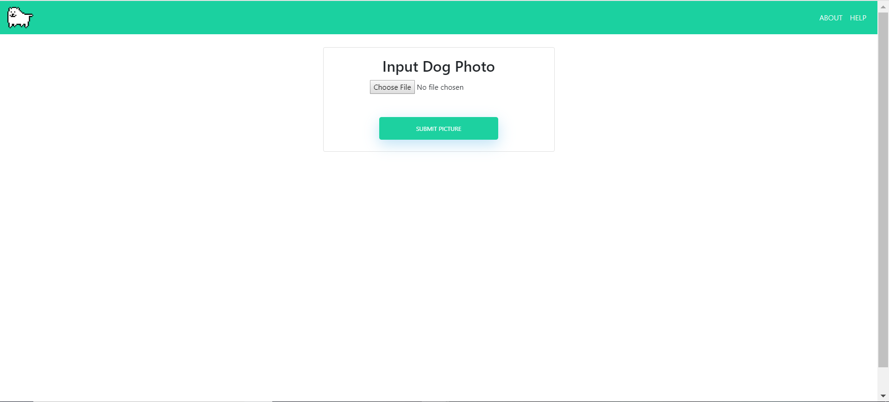
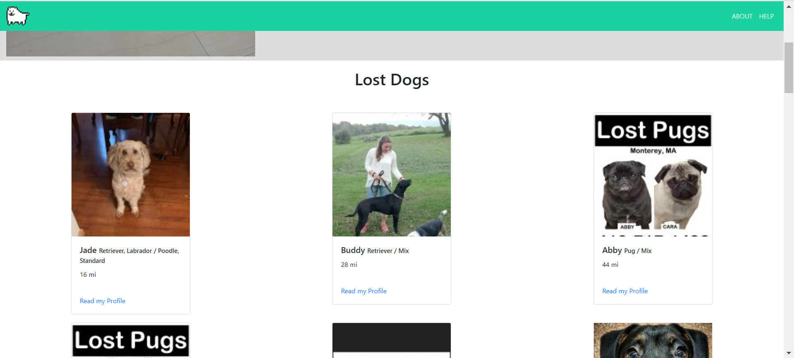

# Doggone It
<!-- [](https://github.com/volkb/Web-Systems-Development-Group-6/blob/master/LICENSE.txt) -->
[](https://github.com/samspre/Doggone-It/graphs/contributors)
[](https://github.com/volkb/Web-Systems-Development-Group-6/commits/master)

## Detecting Dog Breeds through Computer Vision
To format the training images, run create_training-data.py*. This pulls images from a directory that contains fodlers labeled with the respective dog breed name. Inside these folders are images of the repective dog breed. Our model is currently trained on the Standford Dog Dataset. Using Tensorflow and Keras, this program resizes the images to be 90x90 and creates an RGB shape array. The image arrays and their corresponding labels are saved to a file using pickle.

To create and train the model, run create_and_train_model.py*. The model uses the image arrays and labels to train. The images are passed through 4 Dense layers, flattened, and then passed through an output layer. The model is saved to a file using keras' .save() function.

To use the trained model, run 3-predict.py*. This program follows the keras test/prediction techniques. Our GUI makes it easy for users with no coding experience to test our model. 
By using a location feature, we can also search for lost dogs within 500 miles of the user by utilizing online databases.

* Found in the AI Folder
### Contents
  * Members
  * Running the App
  * Using the App

### Members
* Virginia Barnes
* Patrick Gilbert
* Kristofer Kwan
* Eric Miu
* Jinli Park
* Samantha Sprecace

### Running the App

These instructions utilize Bash on Ubuntu for Windows with Git functionality installed

**1. Install Python 3.6**

  Check to see if Python 3.6 is already on your system by typing the following into your preferred shell

  > python3.6 --version

  If you have the latest version (as of this writing), you should see

  > Python 3.6.9

  If Python 3.6 is not installed, update packages if needed and install

  > sudo apt-get update
  >
  > sudo apt-get install python3.6

  Upgrade packages if needed with

  > sudo apt-get upgrade

**2. Clone the Project**

  Perform the following commands to access the repository

  ``` bash
  user@computer:~$ git clone https://github.com/samspre/Doggone-It
  user@computer:~$ cd Doggone-It
  user@computer:~/Doggone-It$ git pull
  ```

**3. Set up the virtual environment**

  ``` bash
  # Windows
  user@computer:~$ .venv/Scripts/activate
  # Mac/OS/Linux/WSL:
  user@computer:~$ source venv/Scripts/activate
  ```

  Install the requiresments file, which places all the python dependencies into your virtual environment

  ``` bash
  (venv) user@computer:~/Doggone-It$ pip3.6 install -r requirements.txt --user
  ```

**4. Run the program**


  ``` bash
  (venv) user@computer:~/Doggone-It$ python3.6 main.py
  * Serving Flask app "main" (lazy loading)
  * Environment: production
    WARNING: Do not use the development server in a production environment.
    Use a production WSGI server instead.
  * Debug mode: on
  * Running on http://127.0.0.1:5000/ (Press CTRL+C to quit)
  * Restarting with stat
  * Debugger is active!
  * Debugger PIN: XXX-XXX-XXX
  ```

  App is now running on the given URL (may be different)
  To quit, use type
  > deactivate

  into the terminal

### Using the App

#### Identification

Import your photos and go!




#### Lost and Found


